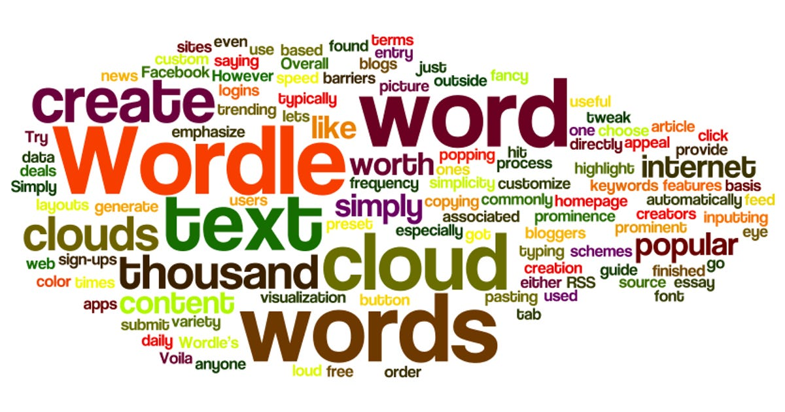
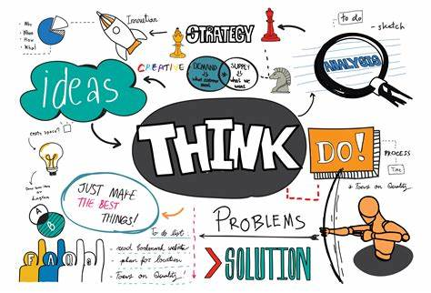

<!doctype html>
<html lang="en">

<head>
    <!-- Required meta tags -->
    <meta charset="utf-8">
    <meta name="viewport" content="width=device-width, initial-scale=1">

    <!-- Font Awesome CDN  -->
    <link rel="stylesheet" href="https://cdnjs.cloudflare.com/ajax/libs/font-awesome/5.14.0/css/all.min.css"
        integrity="sha512-1PKOgIY59xJ8Co8+NE6FZ+LOAZKjy+KY8iq0G4B3CyeY6wYHN3yt9PW0XpSriVlkMXe40PTKnXrLnZ9+fkDaog=="
        crossorigin="anonymous" />

    <!-- CSS -->
    <link rel="stylesheet" href="style.css">

    <title>Anupam Singh</title>
</head>

<body>
<nav id="navbar" class="navbar"></nav>

    <!--=============== NAVIGATION MENU ===============-->

    

        
        
        
        
        
    

    <!--=============== MAIN "WINDOW" ===============-->

    

        <!--=============== HEADER SECTION ===============-->

        <section class="header">
            
            <h1>ANUPAM SINGH</h1>
            <h2>Data Science Enthusiast</h2>
            

                
                
                
            

            <a href="" class="cta">DownIoad CV</a>
        </section>

        <!--=============== CONTENT SECTION ===============-->

        

            <!--=============== HOME ===============-->

            <section class="content-card home" id="welcome-section">
                <h1>Hi, I am <strong>Anupam Singh</strongi</h1>
            </section>

            <!--=============== ABOUT ME ===============-->

            <section class="content-card about" id="about">
                <h1>About me</h1>
                

                    

                        Hello everyone,   I'm Anupam Singh, an undergraduate student pursuing a Bachelor's of Technology in Computer Science and
                        Engineering at United Institute of Technology Prayagraj.   With a strong passion for learning and personal
                        growth, I am actively seeking new experiences and opportunities to apply my skills and contribute to the success of an
                        organization.
                    

                

                

                    

                        <h1>Skills</h1>
                        HTML
                        CSS
                        JavaScript
                        Node.js
                        React
                        SQL
                        Git
                        API
                        Unix/Linux
                        Jira
                        Confluence
                        Figma
                    

            <!--=============== LANGUAGES ===============-->
                    

                        <h1>Languages</h1>
                        

                            
English

                            
                        

                        

                            
Python

                            
                        

                        

                            
C++

                            
                        

                    

                

            </section>

            <!--=============== PROJECTS ===============-->

            <section class="content-card projects" id="projects">
                <h1>Projects</h1>
                

                    

                        
                        

                            

                                <h3>Project 1</h3>
                                <h1>Glass Forms</h1>
                                <h2>HTML | CSS | JavaScript | SQL</h2>
                            

                        

                    

                    

                        
                        

                            

                                <h3>Project 2</h3>
                                <h1>Word Cloud</h1>
                                <h2>Python</h2>
                            

                        

                    

                    

                        
                        

                            

                                <h3>Project 3</h3>
                                <h1>Think Page</h1>
                                <h2>HTML | CSS | JavaScript | NodeJs | MongoDB</h2>
                            

                        

                    

                    

                        
                        

                            

                                <h3>Project 4</h3>
                                <h1>Fleet Management</h1>
                                <h2>React Native | JavaScript | G Map API</h2>
                            

                        

                    

                

                <a href="https://github.com/anupam9919">see more...</a>
            </section>

            <!--=============== EXPERIENCE ===============-->

            <section class="content-card experience" id="experience">
                <h1>Experience</h1>
                

                    

                        

                            
2022 - now

                            

                                <h3>timeline item 1</h3>
                                

                                    Lorem ipsum dolor sit, amet consectetur adipisicing elit.
                                    Ab iusto accusantium nostrum eligendi debitis quisquam.
                                    Corporis at voluptatem culpa officia.
                                

                            

                        

                        

                            
2015 - 2022

                            

                                <h3>timeline item 2</h3>
                                

                                    Lorem ipsum dolor sit, amet consectetur adipisicing elit.
                                    Ab iusto accusantium nostrum eligendi debitis quisquam.
                                    Corporis at voluptatem culpa officia.
                                

                            

                        

                        

                            
2014 - 2015

                            

                                <h3>timeline item 3</h3>
                                

                                    Lorem ipsum dolor sit, amet consectetur adipisicing elit.
                                    Ab iusto accusantium nostrum eligendi debitis quisquam.
                                    Corporis at voluptatem culpa officia.
                                

                            

                        

                    

                

            </section>

            <!--=============== CONTACT ===============-->

            <section class="content-card contact" id="contact">
                <h1>Contact</h1>
                <form class="form" id="form" action="#">
                    

                        <input type="text" class="text-input" name="name" placeholder="Name" />
                    

                    

                        <input type="email" class="text-input" name="email" id="email" placeholder="Email" />
                    

                    

                        <input type="subject" class="text-input" name="subject" id="subject" placeholder="Subject" />
                    

                    

                        <textarea name="text" class="message" placeholder="Message..."></textarea>
                    

                    

                        <input type="submit" class="submit-btn" id="submit" value="submit" />
                    

                </form>
            </section>
        

    

    
</body>

</html>
